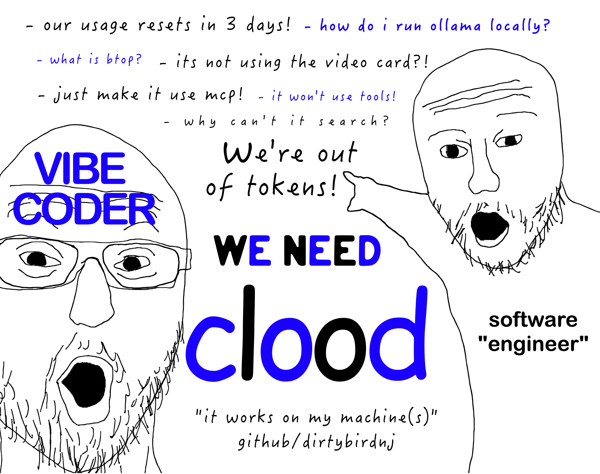

# clood



We want Claude! Too bad, we're out of tokens. We have clood instead.

Local LLM toolkit for a Claude-like experience on your own hardware.

## What is this?

clood is a framework for running local LLMs with:

1. **Tiered Model Inference** - Fast models gather context, powerful models do reasoning
2. **Project Awareness** - Models know about your projects via `projects_manifest.json`
3. **Tool Integration** - MCP servers for filesystem, web search, and GitHub
4. **Multi-Machine Support** - Distribute workloads across your hardware

**Primary Interface:** [Crush CLI](https://github.com/charmbracelet/crush) with local Ollama

## Quick Start

See [START-HERE.md](START-HERE.md) for the complete setup checklist.

### TL;DR

```bash
# 1. Install Ollama
curl -fsSL https://ollama.com/install.sh | sh

# 2. Install Crush
# macOS:
brew install charmbracelet/tap/crush
# Linux: download from https://github.com/charmbracelet/crush/releases

# 3. Pull a model
ollama pull llama3-groq-tool-use:8b

# 4. Start SearXNG (for web search)
cd infrastructure && docker compose up -d searxng

# 5. Copy Crush config
mkdir -p ~/.config/crush
cp infrastructure/configs/crush/crush.json ~/.config/crush/crush.json

# 6. Run Crush
crush
```

## Architecture

```
User Query
    │
    ▼
┌─────────────────────────┐
│  TIER 1: Router         │  TinyLlama (~150 tok/s)
│  Classify query type    │
└───────────┬─────────────┘
            │
    ┌───────┴───────┐
    ▼               ▼
┌─────────┐   ┌─────────┐
│ TIER 2  │   │ TIER 2  │   3B models (~64 tok/s)
│ Search  │   │ Files   │
└────┬────┘   └────┬────┘
     │             │
     └──────┬──────┘
            ▼
┌─────────────────────────┐
│  Context Assembly       │
└───────────┬─────────────┘
            ▼
┌─────────────────────────┐
│  TIER 3: Reasoning      │  7-8B models (~30 tok/s)
│  Generate solution      │
└─────────────────────────┘
```

See [ARCHITECTURE.md](ARCHITECTURE.md) for full details.

## Directory Structure

```
clood/
├── START-HERE.md           # Setup checklist (start here!)
├── ARCHITECTURE.md         # System design and tiered model approach
├── crush.md                # Crush CLI configuration guide
├── ollama-tuning.md        # Performance optimization
├── model-comparison.md     # Model selection guide
│
├── infrastructure/         # Docker configs, service setup
│   ├── docker-compose.yml  # SearXNG container
│   ├── configs/
│   │   ├── crush/          # Crush config template
│   │   └── searxng/        # SearXNG settings
│   └── SSH-SETUP.md        # Multi-machine SSH config
│
├── hardware/               # Machine-specific documentation
│   ├── i7-8086k.md         # CPU tuning (ubuntu25)
│   └── rx590.md            # GPU setup (AMD Vulkan)
│
├── skills/                 # Portable agent capabilities
│   ├── claude-code/        # Slash commands for Claude Code
│   └── prompts/            # Reusable system prompts
│
├── seeds/                  # Templates and examples
│   └── tests/              # Test generation templates
│
├── scripts/                # Utility scripts
│
└── drop-zone/              # Local file staging (gitignored)
```

## Services

| Service | URL | Purpose |
|---------|-----|---------|
| Ollama | http://localhost:11434 | Model serving |
| SearXNG | http://localhost:8888 | Web search (MCP) |
| Crush | CLI | Chat interface with MCP tools |

## MCP Servers (Tools)

Crush is configured with these MCP servers:

| Server | Purpose | Package |
|--------|---------|---------|
| filesystem | Read/write ~/Code | @modelcontextprotocol/server-filesystem |
| searxng | Web search | @kevinwatt/mcp-server-searxng |
| github | gh CLI commands | any-cli-mcp-server |

## Recommended Models

| Use Case | Model | Speed | VRAM |
|----------|-------|-------|------|
| Tool calling | llama3-groq-tool-use:8b | ~30 tok/s | 6GB |
| Coding | qwen2.5-coder:7b | ~32 tok/s | 6GB |
| Fast tasks | qwen2.5-coder:3b | ~64 tok/s | 2.5GB |
| Router | tinyllama | ~150 tok/s | 1GB |

See [model-comparison.md](model-comparison.md) for full comparison.

## Hardware

Currently tested on:

| Machine | GPU | RAM | Role |
|---------|-----|-----|------|
| ubuntu25 | RX 590 8GB (Vulkan) | 64GB | Primary server |
| MacBook Air | M4 16GB | unified | Mobile |
| Mac Mini | M4 24GB | unified | Large models |

## Documentation

| Doc | Purpose |
|-----|---------|
| [START-HERE.md](START-HERE.md) | First-time setup checklist |
| [ARCHITECTURE.md](ARCHITECTURE.md) | System design, tiered models |
| [crush.md](crush.md) | Crush CLI configuration |
| [ollama-tuning.md](ollama-tuning.md) | Performance optimization |
| [model-comparison.md](model-comparison.md) | Model selection |
| [GPU-SETUP.md](GPU-SETUP.md) | AMD GPU with ROCm/Vulkan |
| [WORKFLOW.md](WORKFLOW.md) | Claude Code + Crush workflow |

## TODO

- [ ] Tiered routing prompts for TinyLlama
- [ ] Auto-generate projects_manifest.json script
- [ ] RAG with nomic-embed-text for code search
- [ ] Multi-machine load balancing
- [ ] tmux dashboard script

---

## Archived: Open WebUI

Open WebUI was previously used but abandoned due to broken tool calling in v0.6.13+.
The docker-compose.yml still includes it but Crush is now the recommended interface.

If you want to try Open WebUI anyway:
- Pin to v0.6.10: `ghcr.io/open-webui/open-webui:v0.6.10`
- See infrastructure/docker-compose.yml for config
- Known issues: [#14577](https://github.com/open-webui/open-webui/issues/14577)
